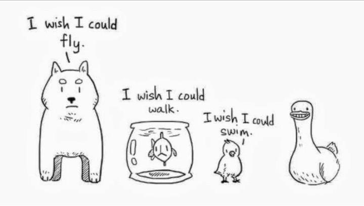

= Plan for Practice #2
:toc:

== Homework
* [ ] Explain the task

== Different OOP Implementations
* [ ] "private" in Python
* [ ] "interfaces" in C++
* [ ] "Diamond" inheritance in C++

== Interface Types
* [ ] Marker
* [ ] Functional
* [ ] Trait, mixin

== Break Barbara Liskov Principle
LSP is about contracts and not about code.

* [ ] Preconditions cannot be strengthened in the subtype
* [ ] Postconditions cannot be weakened in the subtype
* [ ] Invariants must be preserved in the subtype

== Break Inheritance
* [ ] InstrumentedSet
* [ ] ForwardedSet

== Open Closed Principle with Duck Simulator

=== Inheritance

* [ ] Add new behavior -  `fly()`
* [ ] Add a new type - `DecoyDuck`

[plantuml]
----
@startuml
abstract class Duck {
    swim()
    quack()
    {abstract} display()
}

class MallardDuck
class RedheadDuck
class RubberDuck

Duck <|-- MallardDuck
Duck <|-- RedheadDuck
Duck <|-- RubberDuck

MallardDuck : display()
RedheadDuck : display()
RubberDuck : display()
RubberDuck : quack() {squeak}

@enduml
----

=== Interfaces
[plantuml]
----
@startuml
abstract class Duck {
    swim()
    {abstract} display()
}

interface Quackable {
    quack()
}

'interface Flyable {
'    fly()
'}

class MallardDuck {
    display()
'    fly()
    quack()
}
class RedheadDuck {
    display()
'    fly()
    quack()
}
class RubberDuck {
    display()
    quack()
}

Duck <|-- MallardDuck
Duck <|-- RedheadDuck
Duck <|-- RubberDuck

Quackable <|.. MallardDuck
Quackable <|.. RedheadDuck
Quackable <|.. RubberDuck

'Flyable <|.. MallardDuck
'Flyable <|.. RedheadDuck
'Flyable <|.. RubberDuck

@enduml
----

=== Composition

[plantuml]
----
@startuml
abstract class Duck {
    QuackBehavior : quackBehavior
    performQuack()
    swim()
    {abstract} display()
}

interface QuackBehavior {
    quack()
}

class Quack {
    quack()
}

class Squeak {
    quack() // rubber duck squeak
}

QuackBehavior <|.. Quack
QuackBehavior <|.. Squeak

class MallardDuck
class RedheadDuck
class RubberDuck

QuackBehavior *-- Duck
Duck <|-- MallardDuck
Duck <|-- RedheadDuck
Duck <|-- RubberDuck

MallardDuck : display()
RedheadDuck : display()
RubberDuck : display()
@enduml
----

==== Composition vs Aggregation
An explanation from Stackoverflow https://softwareengineering.stackexchange.com/a/61527/314568

* `A` "owns" `B` => Composition: `B` has no meaning or purpose in the system without `A`
* `A` "uses" `B` => Aggregation: `B` exists independently (conceptually) from `A`fa

.Example 1:
....
A Company is an aggregation of People. A Company is a composition of Accounts. When a Company ceases to do business its Accounts cease to exist but its People continue to exist.
....

.Example 2: (very simplified)
....
A Text Editor owns a Buffer (composition). A Text Editor uses a File (aggregation). When the Text Editor is closed, the Buffer is destroyed but the File itself is not destroyed.
....

== Show Dependency Injection (DI)
